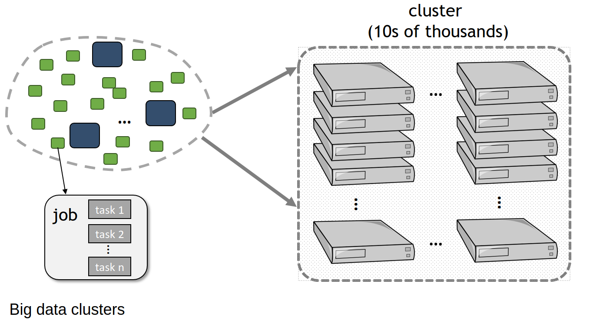
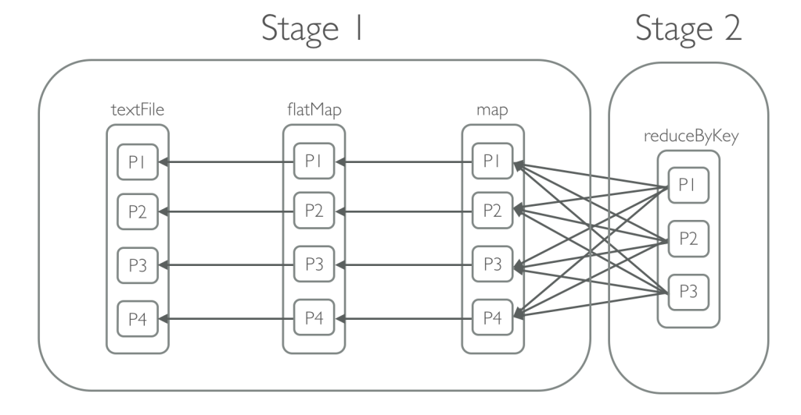
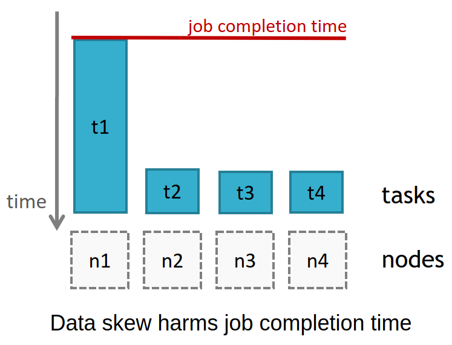

# DSLab 2020 Week 7

## Spark 3/3: Partitioning

<p style="text-align: center;">
   
</p>

<p style="text-align: right;"><em><strong>Pamela Delgado</em></strong></p>

--

## Previously

* Introduction to Spark
* RDDs: Spark's core data abstraction
* Operations on RDDs: transformations and actions
* DataFrames and SparkSQL operations

### This week

* Spark data partitioning

---

## Parallelization and partitions

--

## RDD revisit

* RDD: Resilient Distributed Dataset
* Resilient: if a node dies data can be regenerated
* **Distributed**: scattered pieces of data in the cluster

--

## How to create an RDD?

* Reference external data
* `sc.parallelize(data)`
* Each piece of data becomes a task

## Why parallelize?

* Take advantage of distributed resources

--

## How many partitions?

* Find the right number of partitions
   * Too few: becomes centralized
   * Too many: non meaningful chunk of work
* Normally 2-4 partitions per CPU

--

## How is parallelization done?

* automatically
   * check default number of partitions

  ```
  sc.defaultParallelism()
  rdd.getNumPartitions()
  rdd.glom().collect()
  ```

* configurable
   * create RDD with custom number of partition

  ```
  sc.parallelize(data,num_partitions)
  ```

   * modify the number of partitions

  ```
  rdd.repartition()
  rdd.repartitionAndSortWithinPartitions()
  rdd.coalesce()
  ```


--

## How big are Spark's partitions?

* An HDFS block is 128MB by default
* Configurable
* Find the right granularity
   * Too large: might not fit in memory
   * Too small: transfer & setup can take longer than execution
* 128MB is normally ok

---

## Efficient partitioning


--

## Spark and big data

* So far: small data, small cluster
* New scenario: big data, big cluster

<p style="text-align: center;">
  
</p>

--

# Time-space efficiency is important

* Locality principle: run task with 'local' data
* Shuffle operations are costly

--


## What is a shuffle operation?

* All-to-all operation
* It needs to transfer (shuffle) data among all executors

<p style="text-align: center;">
  
</p>


--

## Why shuffle is costly?

* Every transfer involves
  * disk I/O
  * serialization
  * network I/O
  * (maybe) heap memory --> spill to disk --> disk I/O
  * operations run on a JVM

--

## Other considerations

* Data can be skewed!!
* Often the case for social data

<p style="text-align: center;">
  
</p>

--

## Spark partitioners

* HashPartitioner
  * hash code of an object

* RangePartitioner
  * sortable records

* Custom partitioner!
  * Need to extend [org.apache.spark.Partitioner](https://github.com/apache/spark/blob/master/core/src/main/scala/org/apache/spark/Partitioner.scala)
  * Overwrite methods
  ```
  def numPartitions: Int
  def getPartition(key: Any): Int
  ```
  * And define the comparison method
  ```
  def equals(other: Any): Boolean
  ```
--

## How to apply a partitioner?

* `rdd.partitionBy(num_partitions)`
* `rdd.partitionBy(new HashPartitioner(num_partitions))`
* Spark will use `partition = partitionFunc(key) % num_partitions`
* where `partitionFunc` is the used partitioner

---

## [Partitioning demo](./partitioning-demo.html)

* [Download the notebook](./partitioning-demo.ipynb)


---

## Spark takeaways

* Spark widely adopted because of flexibility
  * languages: Scala, Java, Python, R
  * databases: HDFS, shared filesystem,  HBase, any Hadoop InputFormat
  * paradigms: relational, streaming, key value
  * deployments:
* Actively maintained, Spark "ecosystem" components
* Main benefit for datascience: parallelization
